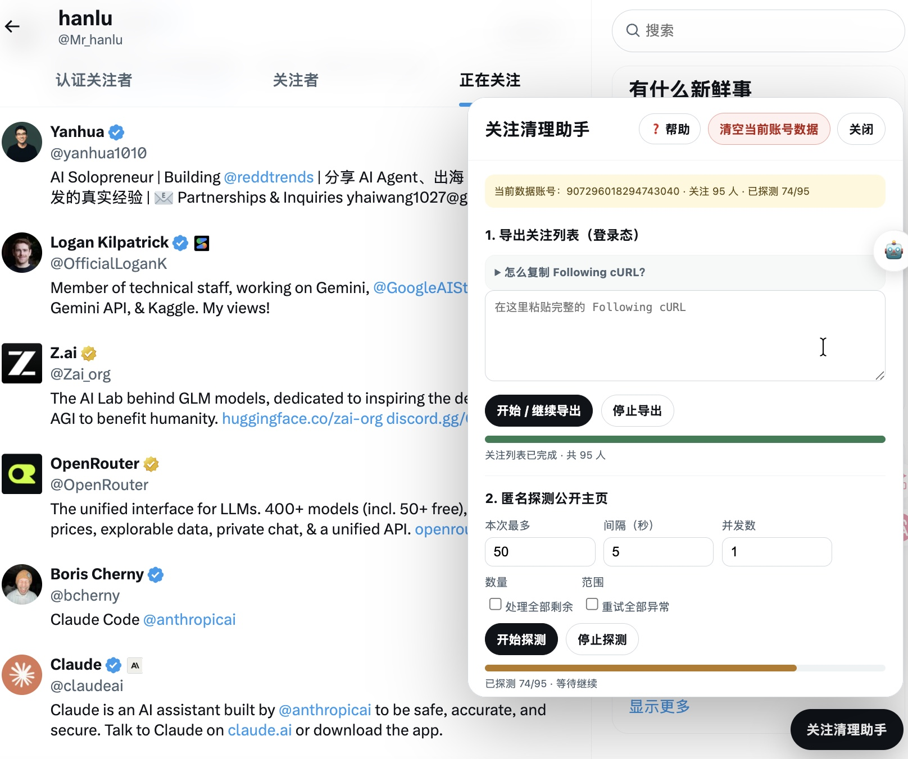
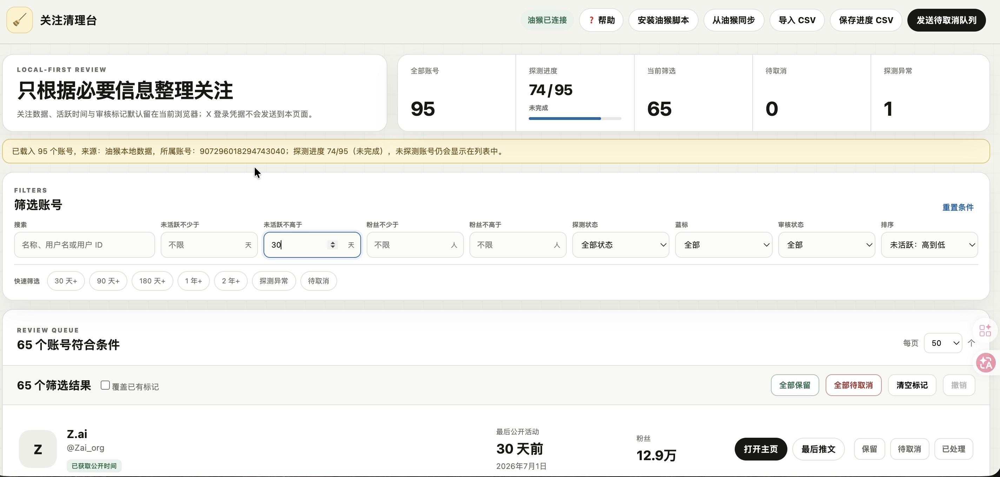

# X/推特取关助手

一款 X（Twitter/推特）批量取关工具：本地导出并筛选关注列表，匿名检查最近可见推文时间，再把确认过的账号安全分批取消关注。

- [安装油猴脚本（Greasy Fork）](https://greasyfork.org/zh-CN/scripts/589294-x-%E5%85%B3%E6%B3%A8%E6%B8%85%E7%90%86%E5%8A%A9%E6%89%8B)
- [打开 X/推特取关助手](https://x-follow-cleaner.mrhanlu224.workers.dev/)
- [查看完整技术说明](./TECHNICAL.md)

## 效果预览

### 油猴插件面板



### 静态筛选页面



## 主要功能

- 断点导出当前账号的完整关注列表
- 匿名请求公开主页，只保留最近可见推文时间等必要字段
- 按距最近可见推文天数、粉丝数、检查状态和审核状态筛选
- 批量标记保留、待取消或已处理
- CSV 备份、进度恢复和多账号数据隔离
- 按确认队列分批取消关注，失败可重试，成功账号不会重复执行
- 遇到 429 时停止并保存进度

## 快速开始

1. 安装脚本并登录 X，打开自己的“正在关注”页面。
2. 点击右下角“X/推特取关助手”。
3. 展开“怎么复制 Following cURL？”，按说明复制并粘贴请求，然后开始导出。
4. 在“检查最近可见推文时间”中设置数量、间隔和并发，先用小批量验证。
5. 点击“打开筛选页面”，页面会自动从油猴同步数据。
6. 筛选并标记账号，点击“发送待取消队列”。
7. 返回 X，设置本批数量和间隔，确认后执行。
8. 定期使用“保存进度 CSV”备份。

插件面板和筛选页面右上角都有 `❓`，可随时查看简洁流程说明。

## 如何复制 Following cURL

插件面板内已经提供默认收起的操作说明：

1. 打开自己的“正在关注”页面。
2. 按 `F12` 打开开发者工具，选择 `Network / 网络` 和 `Fetch/XHR`。
3. 搜索 `Following`，必要时向下滚动一次关注列表触发请求。
4. 右键 Following 请求，选择 `Copy → Copy as cURL (bash)`。
5. 将完整内容粘贴到插件输入框。

脚本只保存请求结构和分页参数，不保存原始 cURL、Cookie 或 `ct0`。取消关注的请求模板默认自动生成，不需要再复制第二个 cURL。

## 数据与隐私

- 关注数据、探测结果、审核标记和取消队列默认保存在油猴及当前浏览器本地。
- Cloudflare 筛选页面不会接收 X Cookie、`ct0`、Authorization 或原始 cURL。
- 匿名探测使用 `GM_xmlhttpRequest({ anonymous: true })`，不会发送 X 登录 Cookie。
- 匿名请求仍会暴露当前网络 IP 和常规网络特征，也可能遇到限流。
- 公开主页响应解析后立即丢弃，不保存原始 HTML。
- 数据按照 Following 请求中的 `source_user_id` 隔离；取消关注前会核对当前登录账号。
- 新版 CSV 会在每一行保存 `source_user_id`。油猴数据被清空后，可在筛选页面导入备份并点击“发送待取消队列”，确认后恢复账号数据和审核标记。
- 从 CSV 恢复只允许写入空的数据集；如果油猴已有其他账号的数据或 CSV 缺少所属账号 ID，会拒绝覆盖并给出提示。

## 数据口径

公开主页通常只提供少量可见内容。`last_post_at` 表示匿名主页响应中可解析到的最近可见推文时间，可以理解为本次响应里的“最后发推时间”；它不代表完整推文历史，也不保证覆盖仅登录可见或受保护内容。

主要字段：

- `last_post_at` / `inactive_days`
- `last_post_id` / `last_post_url`
- `data_status` / `fetched_at`
- `followers_count` / `is_blue_verified`
- `review_status`
- `unfollow_status` / `unfollowed_at`

## 队列规则

- 网页发送的是当前完整的待取消选择。
- 空选择会清空尚未执行的待处理队列，但不会删除成功历史。
- 待处理队列只保存尚未处理和失败待重试的账号。
- 成功账号会从待处理队列移除，并保存成功时间与状态。
- 已成功账号不会因为网页重复发送选择而再次执行。

## 使用建议与已知边界

- 最近推文检查默认使用间隔 `1` 秒、并发 `8`、每次 `50` 人；遇到 429 时会停止并保存进度，请降低并发或延长间隔后继续。
- 取消关注建议从每批 `10` 人、间隔 `5` 秒开始。
- 并发和速度越高，越容易遇到 429；遇到限制后请稍后继续。
- 匿名探测、筛选标记和取消任务使用相互隔离的本地存储，可以同时进行；同一种任务不能在多个 X 标签页重复启动。
- 后台标签页可能被浏览器节流或冻结，脚本会在切换后台时保存缓冲结果，恢复后可从检查点继续。
- X 内部 GraphQL query ID、features 和页面结构可能变化，因此 Following 暂时保留手动粘贴当前 cURL。
- 油猴存储承担断点保存，应定期导出 CSV，避免浏览器数据清理后无法恢复。

---

# 工程说明

这是一个同时包含油猴脚本和 Cloudflare 静态页面的项目，不使用 React、数据库或后端服务。

- 油猴脚本运行在 `x.com`，负责导出关注列表、匿名探测、断点保存和分批取消关注。
- 静态页面负责筛选、批量标记、CSV 备份，以及把完整待取消选择交回油猴脚本。
- 两个页面通过油猴存储和浏览器自定义事件进行本地桥接。

## 目录

```text
src/                 油猴脚本模块源码
scripts/build.mjs    无第三方依赖的构建脚本
scripts/test.mjs     存储、探测、队列和构建测试
dist/                本地构建的油猴安装文件
web/                 Cloudflare 部署目录
web/download/        页面提供下载的油猴安装文件
GREASYFORK.md        可粘贴到 Greasy Fork 的中英文说明
TECHNICAL.md         当前实现、数据流与多语言演进说明
LICENSE              MIT 许可证
```

主要模块：

- `core.js`：存储、账号隔离、CSV 和通用工具
- `curl.js`：解析并清理用户粘贴的 cURL
- `following.js`：登录态导出 Following
- `profile-probe.js`：匿名请求公开主页并提取最近可见推文时间
- `unfollow.js`：活动队列和分批取消关注
- `bridge.js`：油猴与筛选页面之间的数据桥
- `panel.js`：X 页面右下角控制面板

## 本地构建与测试

需要 Node.js，不需要安装 npm 依赖。

```bash
cd x-follow-cleaner
npm test
npm run build
```

构建会生成两份相同的安装文件：

```text
dist/x-follow-cleaner.user.js
web/download/x-follow-cleaner.user.js
```

正式地址配置在 `.env.production`：

```text
DASHBOARD_URL=https://x-follow-cleaner.mrhanlu224.workers.dev/
```

## 本地预览

为了测试油猴跨页面桥，应通过 HTTP 打开网页：

```bash
cd web
python3 -m http.server 8788
```

访问 `http://localhost:8788/`。本地联调油猴匹配域名时使用：

```bash
npm run build:local
```

该命令会生成匹配 `http://localhost:8788/` 的临时脚本；发布前必须重新执行正式构建。

## Cloudflare 部署

推荐配置：

- Root directory：`x-follow-cleaner`
- Build command：`npm run build`
- Build output directory：`web`
- 环境变量：`DASHBOARD_URL=https://x-follow-cleaner.mrhanlu224.workers.dev/`

油猴必须提前通过 `@match` 声明筛选页域名，因此日常使用应采用固定正式域名，不要依赖随机预览域名。

## Greasy Fork 更新

同步源：

```text
https://raw.githubusercontent.com/mr-hanlu/x-follow-cleaner/main/web/download/x-follow-cleaner.user.js
```

发布前：

1. 修改 `src/metadata.txt` 中的 `@version`。
2. 执行 `npm test && npm run build`。
3. 确认产物匹配正式 Cloudflare 域名。
4. 提交源码和 `web/download/x-follow-cleaner.user.js` 并推送到 `main`。
5. 使用 `GREASYFORK.md` 更新中英文页面说明。

Greasy Fork 会改写通过其安装的脚本更新地址，使后续更新继续经过 Greasy Fork。

## 安全约束

- 日志不打印原始 cURL、Cookie、`ct0` 或 Authorization。
- 匿名主页请求不携带 X 登录 Cookie。
- 取消关注必须在 X 页面使用当前登录状态，并在执行前重新读取 `ct0`。
- 活动队列与历史状态分离；成功账号不会重复进入活动队列。
- 工具不会尝试轮换令牌或绕过平台限流。

## 支持开发

X/推特取关助手（X Follow Cleaner）免费开放使用。如果它帮你节省了时间，可以自愿支持后续维护和浏览器扩展开发。赞助不会解锁额外功能，也不会影响正常使用。

### 支付宝


### 链上赞助

- SOL（Solana Mainnet，仅接收 SOL）：`9tguPb7HzyhhhXV8W4MmVv1a2YWkzK7gUG1e3kjpJAC1`
- ETH（Ethereum Mainnet，仅接收 ETH）：`0xc91b1fAF0F82A1CC4EC2Eb9882EDA79a946Ae6D3`
- BTC（Bitcoin Mainnet，仅接收 BTC）：`bc1qlvzc7aymxtvxsfagd8uu2yr9f484d7l9hm939j`

转账前请确认网络和地址。链上转账通常无法撤销。也可以[打开完整赞助页面](https://x-follow-cleaner.mrhanlu224.workers.dev/sponsor/)查看并复制地址。

## 许可证

[MIT](./LICENSE)
